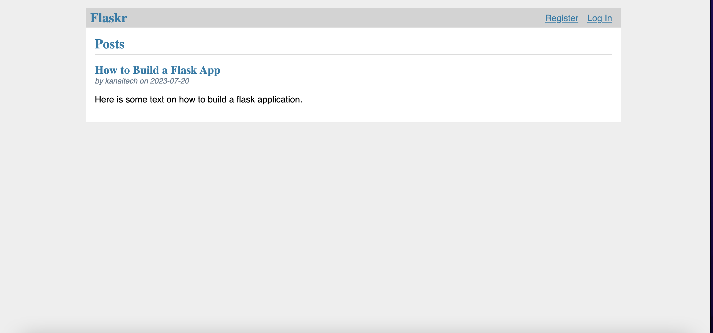
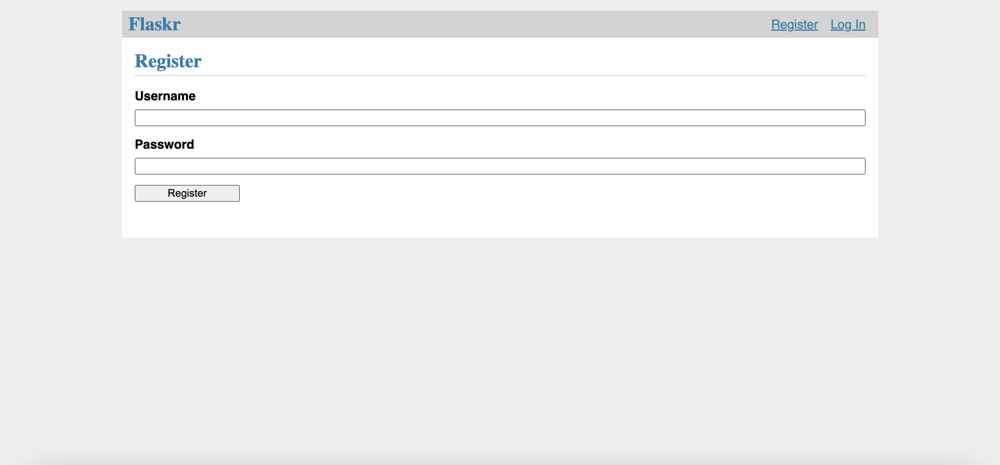
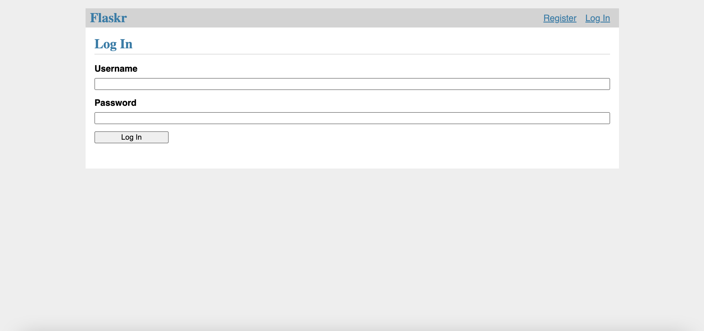
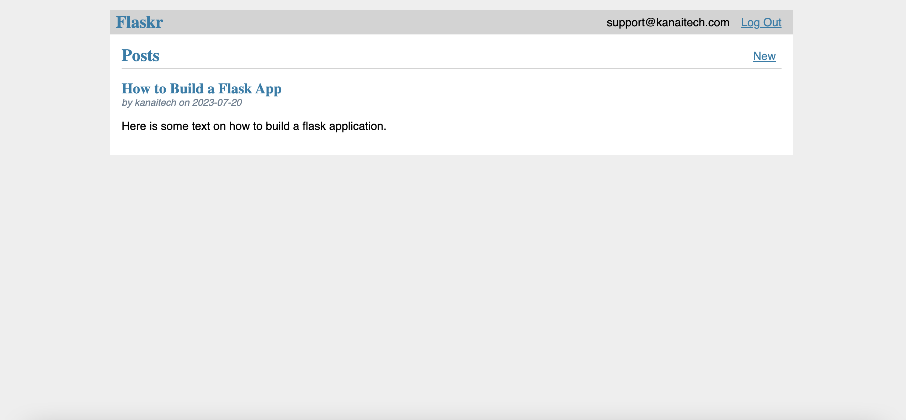
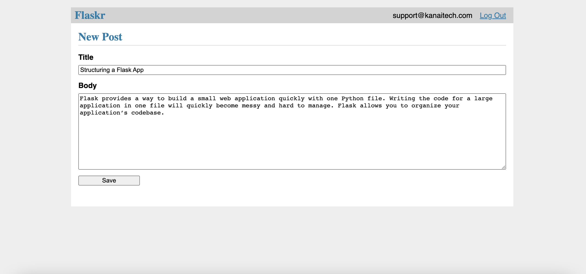
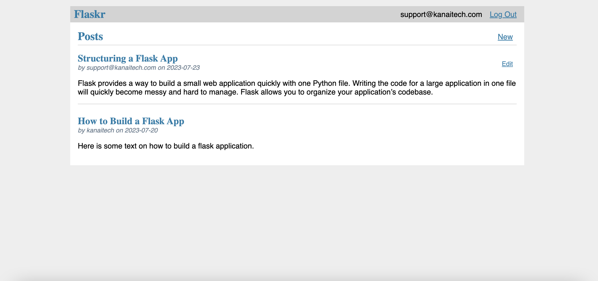
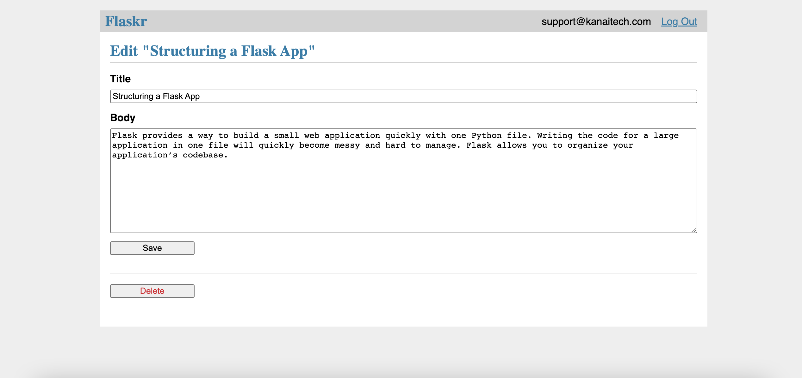

# Flaskr - Basic Blog Application

This project will walk you through creating a basic blog application called Flaskr. Users will be able to register, log in, create posts, and edit or delete their own posts. 

The content of this project builds upon the information in the official documentation. I highly recommend that you go through [the user guide](https://flask.palletsprojects.com/en/2.3.x/#user-s-guide) and follow along with the [tutorial](https://flask.palletsprojects.com/en/2.3.x/tutorial/). This will give you a chance to become familiar with the vocabulary of Flask. You should understand what views are, the basics of Jinja templating and other fundamental concepts defined for beginners.

```
Contents:
1. Project Layout
2. Application Setup
   The Application Factory
   Run The Application
3. Define and Access the Database
   Connect to the Database
   Create the Tables
   Register with the Application
   Initialize the Database File
4. Blueprints and Views
   Create a Blueprint
   Regiser View
   Login View
   Logout View
   Require Authentication in Other Views
   Endpoint and URLs
5. Templates
   The Base Layout
   Register Template
   Login Template
   Register User
6. Static Files
7. Blog Blueprint
   Index
   Create
   Update
   Delete
8. Make the Project Installable
   Describe the project
   Intall the Project
9. Test Coverage
   Setup and Fixtures
   Factory
   Database
   Authentication
   Blog
   Running the Tests
10.Deploy to Production
   Build and Install
   Configure Secret Key
   Run with a Production Server
11.Keep Developing

This course walks you the process of creating a basic blog application called Flaskr. Users will be able to:
1. Register
2. Login
3. Create posts
4. Edit or delete own posts
You will be able to package and install the application on other computers.
```

<p>
  
</p>

<p>
  
</p>

<p>
  
</p>

<p>
  
</p>

<p>
  
</p>

<p>
  
</p>

<p>
  
</p>


## 1. Introduction

While it's designed to give a good starting point, the course does not cover all of Flask's features. Check out the [Quickstart](https://flask.palletsprojects.com/en/2.3.x/quickstart/) for an overview of what Flask can do, then dive into the docs to find out more. The course only uses what's provided by Flask and [Python](https://docs.python.org/3/tutorial/).

Flask is flexible. It doesn't require you to use any particular project or code layout. However, when first starting, it's helpful to use a more structured approach. This means that the course will require a bit of boilerplate up front but it's done to avoid many commone pitfalls that new developers encounter, and it creates a project that's easy to expand on. Once you become more comfortable with Flask, you can step out of this structure and take full advantange of Flask's flexibility.

## 2. Project Layout

Create a project directory and enter it:
    
```
$ mkdir flask-project
$ cd flask-project
```

Then setup a Python [virtual environment](https://flask.palletsprojects.com/en/2.3.x/installation/) and install Flask for your project. The course will assume you're working from the `flask-project` directory from now on. The file names at the top of each code block are relative to this directory.

```
# main.py
from flask import Flask

app = Flask(__name__)

@app.route('/')
def hello():
    return 'Hell, World!'
```

However, as the project gets bigger, it becomes overwhelming to keep all the code in one file. Python projects use *packages* to organize code into multiple modules that can be imported where needed, and the course will do this as well.

The project directory will contain:
* `flaskr/`, a Python package containing your application code and files.
* `tests/`, a directory containing test modules.
* `.venv`, a Python virtual environment where Flask and other dependencies are installed.
* Installing files telling Python how to install your project.
* Version control config, such as git. You should make a habit of using some type of version control for all your projects, no matter the size.
* Another other project files you might add in the future.

By the end, your project layout will look like this:
```
/home/user/Projects/flask-project
|-- flaskr/
|   |-- __init__.py
|   |-- db.py
|   |-- schema.sql
|   |-- auth.py
|   |-- blog.py
|   |-- templates/
|   |   |-- base.html
|   |   |-- auth/
|   |   |   |-- login.html
|   |   |   |-- register.html
|   |   |-- blog/
|   |       |-- create.html
|   |       |-- index.html
|   |       |-- update.html
|   |-- static
|   |   |-- style.css
|-- tests/
|   |-- conftest.py
|   |-- data.sql
|   |-- test_factory.py
|   |-- test_db.py
|   |-- test_auth.py
|   |-- test_blog.py
|-- .venv
|-- pyproject.toml
|-- MANIFEST.in
```

## 3. Application Setup

A Flask application is an instance of the **Flask** class. Everything about the application, such as the configuration and URLs, will be registerd with this class.

We learnt, to create a Flask application we had to create a global **Flask** instance directly at the top of your code. While this is simple and useful, it can cause some issues as the project grows.

Instead of creating a **Flask** instance globally, you will create it itside a function. This function is known as the *application factory*. Any configuration, registration, and other setup the application needs will happen inside the function, then the application will be returned.

### 3.1 The Application Factory

It's time to start coding. Create the `flaskr` directory and add the `__init__.py` file. The `__init__.py` serves double duty:
1. it will contain the application factory, and 
2. it tells Python that the `flaskr` directory should be treated as a package.

`$ mkdir flaskr`

```
# flaskr/__init__.py
import os

from flask import Flask


def create_app(test_config=None):
    # create and configure the app
    app = Flask(__name__, instance_relative_config=True)
    app.config.from_mapping(
        SECRET_KEY='dev',
        DATABASE=os.path.join(app.instance_path, 'flaskr.sqlite'),
    )

    if test_config is None:
        # load the instance config, if it exists, when not testing
        app.config.from_pyfile('config.py', silent=True)
    else:
        # load the test config if passed in
        app.config.from_mapping(test_config)

    # ensure the instance folder exists
    try:
        os.makedirs(app.instance_path)
    except OSError:
        pass

    # a simple page that says hello
    @app.route('/hello')
    def hello():
        return 'Hello, World!'

    return app
```

### 3.2 Run The Application

Now you can run your application using the `flask` command. From the terminal, tell Flask where to find your application, then run it in debug mode. Note that you should be in the top-level `flask-project` directory, not the `flaskr` package.

Debug mode shows an interactive debugger whenever a page raises an exception, and restarts the server whenever you make changes to the code. You can leave it runnning and just reload the browser page as you follow the course.

`$ flask --app flaskr run debug`

## 4. Define and Access the Database

The application will use a [SQLite](https://sqlite.org/about.html) database to store users and posts. Python comes with built-in support for SQLite in the **sqlite3** module.

SQLite is convenient because it doesn't require setting up a separate database server and is built-in to Python. However, once you project becomes big, you may want to switch to a different database.

### 4.1 Connect to the Database

* The first step is to create a connection to a SQLite database. 
* Any queries and operations are performed using the connection, which is closed after the work is finished.

In web applications this connection is tied to the request. It is created at some point when handling a request, and closed before the response is sent.

```
# flaskr/db.py
import sqlite3

import click
from flask import current_app, g


def get_db():
    if 'db' not in g:
        g.db = sqlite3.connect(
            current_app.config['DATABASE'],
            detect_types=sqlite3.PARSE_DECLTYPES
        )
        g.db.row_factory = sqlite3.Row

    return g.db


def close_db(e=None):
    db = g.pop('db', None)

    if db is not None:
        db.close()
```

* `g`: is a special object that is unique for each request.
    * It is used to store data that might be accessed by multiple functions during the request.
    * The connection is stored and reused instead of creating a new connection if `get_db` is called a second time in the same request.

* `current_app`: is another special object that points to the Flask application handling the request. `get_db` will be called when the application has been created and is handling a request, so `current_app` can be used.

* `sqlite3.connect()`: establishes a connection to the file pointed at the `DATABASE` configuration key.

* `sqlite3.Row`: tells the connection to return rows that behave like dicts. This allows accessing the columns by name.

* `close_db` checks if a connection was created by checking if `g.db` was set. If the connection exists, it is closed.

### 4.2 Create the Tables

* In SQLite, data is stored in tables and columns. These need to be created before you can store and retrieve data. 
* *Flaskr* will store users in the `user` table, and posts in the `post` table. 
* Create a file with the SQL commands needed to create empty tables:

```
# flaskr/schema.sql
DROP TABLE IF EXISTS user;
DROP TABLE IF EXISTS post;

CREATE TABLE user (
  id INTEGER PRIMARY KEY AUTOINCREMENT,
  username TEXT UNIQUE NOT NULL,
  password TEXT NOT NULL
);

CREATE TABLE post (
  id INTEGER PRIMARY KEY AUTOINCREMENT,
  author_id INTEGER NOT NULL,
  created TIMESTAMP NOT NULL DEFAULT CURRENT_TIMESTAMP,
  title TEXT NOT NULL,
  body TEXT NOT NULL,
  FOREIGN KEY (author_id) REFERENCES user (id)
);
```

Add the Python functions that will run these SQL commands to the `db.py` file:

```
# flaskr/db.py
def init_db():
    db = get_db()

    with current_app.open_resource('schema.sql') as f:
        db.executescript(f.read().decode('utf8'))


@click.command('init-db')
def init_db_command():
    """Clear the existing data and create new tables."""
    init_db()
    click.echo('Initialized the database.')
```

* `open_resource()` opens a file relative to the `flaskr` package, which is useful since you won't necessary know where that location is when deploying the application later.

* `get_db` returns a database connection, which is used to execute the commands to read from the file

* `click.command()` defines a command line command called `init-db` that calls the `init_db` function and shows a success message to the user.
    * Read [Command Line Interface](https://flask.palletsprojects.com/en/2.3.x/cli/)

### 4.3 Register with the Application

* `close_db` and `init_db_command` functions need to be registered with the application instance; otherwise they won't be used by the application.
* Write a function that takes an application and does the registration.

```
# flaskr/db.py
def init_app(app):
    app.teardown_appcontext(close_db)
    app.cli.add_command(init_db_command)
```

* `app.teardown_appcontext()` tells Flask to call that function when cleaning up after returning the response

* `app.cli.add_command()` adds a new command that can be called with the `flask` command.

* Import and call this function from the factory. Add code at the end of the factory function

```
def create_app():
    app = ...
    # existing code omitted

    from . import db
    db.init_app(app)

    return app
```

### 4.4 Initialize the Database File

* Once the `init-db` has been registered with the app, call the `flask` command.
* Either stop the server if its stilling, or run this command in a new terminal.
* Run the `init-db` command.

```
$ flask --app flaskr init-db
Initialized the database
```

## 5. Blueprints and Views

* A view function is code to respond to requests in your app.
* Flask uses patterns to match the incoming request URL to the view that should handle it.
* The view returns data that Flask turns into an outgoing response.

### 5.1 Create a Blueprint

* A Blueprint is a way to organize a group of related views and other code.
* Flaskr will have two blueprints, on for authentication functions and one for the blog posts functions.
* The code for each blueprint will go in a separate module.
* Since the blog needs to know authentication, you'll write the authentication one first.

```
import functools

from flask import (
    Blueprint, flash, g, redirect, render_template, request, session, url_for
)
from werkzeug.security import check_password_hash, generate_password_hash

from flaskr.db import get_db

auth = Blueprint('auth', __name__, url_prefix='/auth')
```

* This creates a Blueprint name `'auth'`. 
* The `__name__` is passed as the second argument to know where its defined.
* The `url_prefix` will be prepended to all the URL associated with the blueprint.

* Import and report the blueprint from the factory using `app.register_blueprint`. Add code at the end of the factory before returning the app.

```
# flaskr/__init__.py¶
def create_app():
    app = ...
    # existing code omitted

    from . import auth
    app.register_blueprint(auth.auth)

    return app
```

### 5.2 Register View

* When the user visits the `auth/register/` URL, the `register` view will return [HTML]() with a form for them to fill out.
* When they submit the form, it will validate their input and either show the form again with ane error message or create the new user and go to the login page.

```
# flaskr/auth.py
@auth.route('/register', methods=('GET', 'POST'))
def register():
    if request.method == 'POST':
        username = request.form['username']
        password = request.form['password']
        db = get_db()
        error = None

        if not username:
            error = 'Username is required.'
        elif not password:
            error = 'Password is required.'

        if error is None:
            try:
                db.execute(
                    "INSERT INTO user (username, password) VALUES (?, ?)",
                    (username, generate_password_hash(password)),
                )
                db.commit()
            except db.IntegrityError:
                error = f"User {username} is already registered."
            else:
                return redirect(url_for("auth.login"))

        flash(error)

    return render_template('auth/register.html')
```

Here's what the `register` view function is doing:
1. **@auth.route** associates the URL `/register` with the `register` view function. When Flask receives a request to `/auth/register`, it will call the `register` view and use the return value as the response.
2. If the user submitted the form, **request.method** will be `'POST'`. In this case start validating the input.
3. **request.form** is a special type of **dict** mapping submitted form keys and values. The user will input their `username` and `password`.
4. Validate that `username` and `password` are not empty.
5. If validation succeeds, insert the new user data into the database.
    * `db.execute` takes a SQL query with `?` placeholders for any user input, a tuple of values to replace the placeholders with. The database library will take care of escaping the values so you are not vulnerable to a *SQL injection attack*
    * For security, password should never be stored in the database directly. Instead, `generate_password_hash()` is used to securely hash the password, and that hash is stored. Since this query modifiers data, `db.commit()` needs to be called afterwards to save the changes.
    * An `sqlite3.IntegrityError` will occur if the username already exists, which should be shown to the user as another validation error.

6. After storing the user, they are redirected to the login page. `url_for()` generates the URL for the login view based on its name. This is preferable to writing the URL directly as it allows you to change the URL later without changing all code that links to it. `redirect()` generates a redirect response to the generated URL.
7. If validation fails, the error is shown to the user. `flash()` stores messages that can be retrieved when rendering the template.
8. When the user initially navigates to `auth/register`, or there was a validation error, and HTML page with the registration form should be shown. `render_template()` will render a template containing the HTML.

### 5.3 Login View

```
# flaskr/auth.py
@auth.route('/login', methods=('GET', 'POST'))
def login():
    if request.method == 'POST':
        username = request.form['username']
        password = request.form['password']
        db = get_db()
        error = None
        user = db.execute(
            'SELECT * FROM user WHERE username = ?', (username,)
        ).fetchone()

        if user is None:
            error = 'Incorrect username.'
        elif not check_password_hash(user['password'], password):
            error = 'Incorrect password.'

        if error is None:
            session.clear()
            session['user_id'] = user['id']
            return redirect(url_for('index'))

        flash(error)

    return render_template('auth/login.html')
```

There are a few differences from the `register` view
1. The user is queried first and stored in a variable for later use.
    * `fetchone()` returns one row from the query. If the query returned no results, it returns `None`. 
    * `fetchall()` returns a list of all results.
2. `check_password_hash()` hashes the submitted password in the same way as the stored hash and securely compares them. If they match, the password is valid.
3. **session** is a **dict** that stores data across requests. When validation succeeds, the user's `id` is stored in a new session. The data is stored in a **cookie** that is sent to the browser, and the browser then sends it back with subsequent requests. Flask securely *signs* the data so that it can't be tampered with.

Now that the user's `id` is stored in the **session**, it will be available on subsequent requests. At the beginning of each request, if a user is logged in their information should be loaded and made available to other views.

```
# flaskr/auth.py
@auth.before_app_request
def load_logged_in_user():
    user_id = session.get('user_id')

    if user_id is None:
        g.user = None
    else:
        g.user = get_db().execute(
            'SELECT * FROM user WHERE id = ?', (user_id,)
        ).fetchone()
```

* `auth.before_app_request()` registers a function that runs before the view function, no matter what URL is request.
* `load_logged_in_user` checks if a user `id` is stored in the **session** and gets that user's data from the database, storing it on `g.user`, which lasts for the length of the request.
* If there is no user id, or if the id doesn't exist, `g.user` will be `None`.

### 5.4 Logout

* To log out, you need to remove the user id from the **session**. 
* Then `load_logged_in_user` won't load a user on subsequent requests.

```
# flaskr/auth.py
@auth.route('/logout')
def logout():
    session.clear()
    return redirect(url_for('index'))
```

### 5.5 Require Authentication in Other Views

* Creating, editing, and deleting blog posts will require a user to be logged in.
* A *decorator* can be used to check this for each view it's applied to.

```
def login_required(view):
    @functools.wraps(view)
    def wrapped_view(**kwargs):
        if g.user is None:
            return redirect(url_for('auth.login'))

        return view(**kwargs)

    return wrapped_view
```

* This decorator returns a new view function that wraps the original view it's applied to.
* The new function checks if a user is loaded and redirects to the login page otherwise.
* If a user is loaded the original view is called and continues normally.
* You'll use this decorator when writing the blog views

### 5.6 Endpoints and URLs

* The `url_for()` function generates the URL to a view based on a name and arguments.
* The `name` associated with a view is also called the **endpoint**
* By default it's the same as the name of the view function.

For example: `hello()` view that was added to the app factory earlier in the course earlier has the name `hello` and can be linked to with `url_for('hello')`. If it took an argument, it would be linked to using `url_for('hello', who='World')`

When using a blueprint, the name of the blueprint is prepended to the name fo the function, so the endpoint for the `login` function you wrote above is `'auth.login'` because you added it to the `'auth'` blueprint.

## 6. Templates

* You've written the authentication views for your application, but if you're running the server and try to go to any of the URLs, you'll see a `TemplateNotFound` error because the views are calling `render_template()` but template has not been created yet.
* The template files will be stored in the `templates` directory inside the `flaskr` package.
* Templates are files that contain static data as well as placeholders for dynamic data. Flask uses the [Jinja](https://jinja.palletsprojects.com/en/3.1.x/templates/) template library to render templates. It's safe to render user input with Jinja; any characters they've entered `<` adn `>` will be *escaped* with *safe* values that look the same in the browser but don't cause unwanted effects

* In this application, you will use templates to render [HTML](https://developer.mozilla.org/en-US/docs/Web/HTML) which will display in the user's browser.
* Jinja Syntax:
    * Anything between `{{` and `}}` is an expression that will be output to the final document.
    * `` denotes a control flow statement like `if` and `for`. 
    * Unlike Python, block are denoted by **start** and **end** tags rather than indentation since static text within a block could change indentation.
    
### 6.1 The Base Layout

Each page in the application will have the same basic layout around a different body. Instead of writing the entire HTML structure in each template, each template will *extend* a base template and override specific sections.

```
<!doctype html>
<title> - Flaskr</title>
<link rel="stylesheet" href="{{ url_for('static', filename='style.css') }}">
<nav>
  <h1>Flaskr</h1>
  <ul>
    
      <li><span>{{ g.user['username'] }}</span>
      <li><a href="{{ url_for('auth.logout') }}">Log Out</a>
    
      <li><a href="{{ url_for('auth.register') }}">Register</a>
      <li><a href="{{ url_for('auth.login') }}">Log In</a>
    
  </ul>
</nav>
<section class="content">
  <header>
    
  </header>
  
    <div class="flash">{{ message }}</div>
  
  
</section>
```

* `g` is automatically available in templates. Based on if `g.user` is set (from `load_logged_in_user`), either the username and a log out link are displayed, or links to register and login are displayed.
* `url_for()` is also automatically available, and is used to generate URLs to views instead of writing them out manually.
* After the page title, and before the content, the template loops over each message returned by `get_flashed_messages()`. `flask()` is used in the views to show error messages, and this is the code that will display them.
* There are three blocks defined here that will be overridden in the other templates:
    1. `` will change the title display in the browser's tab and window title.
    2. `` is similar to `title` but will change the title displayed on the page.
    3. `` is where the content of each page goes, such as the login form or a blog post.
    
The base template is directly in the `templates` directory. To keep the others organized, the templates for a blueprint will be placed in a directory with the same name as the blueprint.

### 6.2 Register Template

```
# flaskr/templates/auth/register.html



  <h1>Register</h1>



  <form method="post">
    <label for="username">Username</label>
    <input name="username" id="username" required>
    <label for="password">Password</label>
    <input type="password" name="password" id="password" required>
    <input type="submit" value="Register">
  </form>

```

* `` tells Jinja that this template should replace the blocks from the base template. 
* A useful pattern used here is to place `` inside ``. This will set the title block and then output the value of it into the header block, so that the window and page share the same title without writing it twice.
* The `input` tags are using the `required` attribute here. This tells the browser not to submit the form until those field are filled in.
* If the user is using an older browser that doesn't support the `required` attribute, or if they are using something besides a browser to make requests, you can validate the data in the Flask view. It's important to always fully validate the data on the server, even if the client does some validation as well.


### 6.3 Login Template

This is identical to the register template except for the title and submit button.

```
# flaskr/templates/auth/login.html



  <h1>Log In</h1>



  <form method="post">
    <label for="username">Username</label>
    <input name="username" id="username" required>
    <label for="password">Password</label>
    <input type="password" name="password" id="password" required>
    <input type="submit" value="Log In">
  </form>

```

### 6.4 Register User

* Now that the authentication templates are written, you can register a user. 
* Make sure the server is still running (`flask run` if it's not) then go to **http://127.0.0.1:5000/auth/register**
* Click the "Register" button without filling out the form and see that the browser shows an error message.
* Try removing the `required` attribute from the `register.html` template and click "Register" again. Instead of the browser showing an error, the page will reload and the error from `flask()` in the view will be shown.
* Fill out a username and password and you'll be redirected to the login page. Try entering an incorrect username, or the correct username and incorrect password. If you login you'll get an error because there'r no `index` view to redirect to yet.

## 7. Static Files

* The authentication views and templates work, but they look very plain right now. Some [CSS](https://developer.mozilla.org/en-US/docs/Web/CSS) can be added to add style to the HTML layout you constructed.
* The style won't change, so it's a **static** file rather than a template.
* Flask automatically adds a `static` view that takes a path relative to the `flaskr/static` directory and serves it.
* The `base.html` template already has a link to the `style.css` file:

```
{{ url_for('static', filename='style.css') }}
```

* Besides CSS, other types of static files might be files with JavaScript functions, or a logo image. They are all placed under the `flaskr/static` directory and referenced with `url_for('static', filename='...')`
* This course isn't focused on how to write CSS, so you can just copy the following into the `flaskr/static/style.css` file:

```
# flaskr/static/style.css
html { font-family: sans-serif; background: #eee; padding: 1rem; }
body { max-width: 960px; margin: 0 auto; background: white; }
h1 { font-family: serif; color: #377ba8; margin: 1rem 0; }
a { color: #377ba8; }
hr { border: none; border-top: 1px solid lightgray; }
nav { background: lightgray; display: flex; align-items: center; padding: 0 0.5rem; }
nav h1 { flex: auto; margin: 0; }
nav h1 a { text-decoration: none; padding: 0.25rem 0.5rem; }
nav ul  { display: flex; list-style: none; margin: 0; padding: 0; }
nav ul li a, nav ul li span, header .action { display: block; padding: 0.5rem; }
.content { padding: 0 1rem 1rem; }
.content > header { border-bottom: 1px solid lightgray; display: flex; align-items: flex-end; }
.content > header h1 { flex: auto; margin: 1rem 0 0.25rem 0; }
.flash { margin: 1em 0; padding: 1em; background: #cae6f6; border: 1px solid #377ba8; }
.post > header { display: flex; align-items: flex-end; font-size: 0.85em; }
.post > header > div:first-of-type { flex: auto; }
.post > header h1 { font-size: 1.5em; margin-bottom: 0; }
.post .about { color: slategray; font-style: italic; }
.post .body { white-space: pre-line; }
.content:last-child { margin-bottom: 0; }
.content form { margin: 1em 0; display: flex; flex-direction: column; }
.content label { font-weight: bold; margin-bottom: 0.5em; }
.content input, .content textarea { margin-bottom: 1em; }
.content textarea { min-height: 12em; resize: vertical; }
input.danger { color: #cc2f2e; }
input[type=submit] { align-self: start; min-width: 10em; }
```

Go to **http://127.0.0.1:5000/auth/login** to see the changes in the styling of the login page.
    
Read more about CSS from [Mozilla's documentation](https://developer.mozilla.org/en-US/docs/Web/CSS). If you can chage a static file, refresh the browser page. If the changes doesn't show up, try clearing your browser's cache.

## 8. Blog Blueprint

* Use the same techniques you learned when writing the authentication blueprint to write the blog blueprint.
* The blog should:
    * list all posts
    * allow logged in users to create posts
    * and allow the author of a post to edit or delete it.
* As you implement each view, keep the development server running.
* As you save your changes, try going to the URL in your browser and testing them out.

```
# flaskr/blog.py
from flask import (
    Blueprint, flash, g, redirect, render_template, request, url_for
)
from werkzeug.exceptions import abort

from flaskr.auth import login_required
from flaskr.db import get_db

blog = Blueprint('blog', __name__)
```

* import and register the blueprint from the factory using `app.register_blueprint()`. 
* Place the new code at the end of the factory function before return the app.

```
# flaskr/__init__.py
def create_app():
    app = ...
    # existing code omitted

    from . import blog
    app.register_blueprint(blog.bp)
    app.add_url_rule('/', endpoint='index') # make the blog the main inex

    return app
```

* Unlike the auth blueprint, the blog blueprint does not have a `url_prefix`. So the `index` view will be at `/`, the `create` view at `/create`, and so on.
* The blog is the main feature of Flaskr, so it makes sense that the blog index will be the main index.
* `app.add_url_rule()` associates the endpoint name `'index'` with the `/` url so that `url_for('index')` or `url_for('blog.index') will both work, generating the same `/` URL either way.
* In another application you might give the blog blueprint a `url_prefix` and define a separate `index` view in the application factory. Then the `index` and `blog.index` endpoints and URLs would be different.


### 8.1 Index

* The endpoint for the `index` view defined below will be `blog.index`.
* The index will show all the posts, most recent first.
* A `JOIN` is used so that the author information from the `user` table is available in the result.

```
# flaskr/blog.py
@blog.route('/')
def index():
    db = get_db()
    posts = db.execute(
        'SELECT p.id, title, body, created, author_id, username'
        ' FROM post p JOIN user u ON p.author_id = u.id'
        ' ORDER BY created DESC'
    ).fetchall()
    return render_template('blog/index.html', posts=posts)
```

```
# flaskr/templates/blog/index.html



  <h1>Posts</h1>
  
    <a class="action" href="{{ url_for('blog.create') }}">New</a>
  



  
    <article class="post">
      <header>
        <div>
          <h1>{{ post['title'] }}</h1>
          <div class="about">by {{ post['username'] }} on {{ post['created'].strftime('%Y-%m-%d') }}</div>
        </div>
        
          <a class="action" href="{{ url_for('blog.update', id=post['id']) }}">Edit</a>
        
      </header>
      <p class="body">{{ post['body'] }}</p>
    </article>
    
      <hr>
    
  

```

- When a user is logged in, the `header` block adds a link to the `create` view.
- When the user is the author of a post, they'll see an "Edit" link update that post. 
- `loop.last` is a special variable available inside [Jinja for loops](https://jinja.palletsprojects.com/en/3.1.x/templates/#for). It is used to display a line after each post except the last one, to visually separate them.

### 8.2 Create

* The `create` view works the same as the auth `register` view. Either the form is displayed, or the posted data is validated and the post is added to the database or an error is shown.
* The `login_required` decorator is used on the blog views. A user must be logged in to visit these views, otherwise they will be redirected to the login page.

```
# flaskr/blog.py
@blog.route('/create', methods=('GET', 'POST'))
@login_required
def create():
    if request.method == 'POST':
        title = request.form['title']
        body = request.form['body']
        error = None

        if not title:
            error = 'Title is required.'

        if error is not None:
            flash(error)
        else:
            db = get_db()
            db.execute(
                'INSERT INTO post (title, body, author_id)'
                ' VALUES (?, ?, ?)',
                (title, body, g.user['id'])
            )
            db.commit()
            return redirect(url_for('blog.index'))

    return render_template('blog/create.html')
```

```
# flaskr/templates/blog/create.html



  <h1>New Post</h1>



  <form method="post">
    <label for="title">Title</label>
    <input name="title" id="title" value="{{ request.form['title'] }}" required>
    <label for="body">Body</label>
    <textarea name="body" id="body">{{ request.form['body'] }}</textarea>
    <input type="submit" value="Save">
  </form>

```

### 8.3 Update

Both `update` and `delete` views will need to fetch a `post` by `id` and check if the author matches the logged in user. To avoid duplication code, write a function to get the post and call it from each view.

```
# flaskr/blog.py
def get_post(id, check_author=True):
    post = get_db().execute(
        'SELECT p.id, title, body, created, author_id, username'
        ' FROM post p JOIN user u ON p.author_id = u.id'
        ' WHERE p.id = ?',
        (id,)
    ).fetchone()

    if post is None:
        abort(404, f"Post id {id} doesn't exist.")

    if check_author and post['author_id'] != g.user['id']:
        abort(403)

    return post
```

* `abort()` will raise a special exception that returns an HTTP status code. It takes an optional message to show with the error, otherwise a default message is used.
    * `404` means "Not Found"
    * `403` means "Forbidden"
    * `401` means "Unauthorized", but you redirect to the login page instead of returning that status.
* `check_author` argument is defined so that the function can be used to get a `post` without checking the author. This can be useful if you wrote a view to show an invidual post on a page, where the user doesn't matter because they're not modifying the post.

```
# flaskr/blog.py
@blog.route('/<int:id>/update', methods=('GET', 'POST'))
@login_required
def update(id):
    post = get_post(id)

    if request.method == 'POST':
        title = request.form['title']
        body = request.form['body']
        error = None

        if not title:
            error = 'Title is required.'

        if error is not None:
            flash(error)
        else:
            db = get_db()
            db.execute(
                'UPDATE post SET title = ?, body = ?'
                ' WHERE id = ?',
                (title, body, id)
            )
            db.commit()
            return redirect(url_for('blog.index'))

    return render_template('blog/update.html', post=post)
```

* Unlike the views earlier, the `update` function takes an argument, `id` that corresponds to the `<int:id>` in the route. 
* A real URL will look like `/1/update`. Flask will capture the `1`, ensure it's an `int`, and pass it as the `id` argument.
* If you don't specify `int:` and instead do `<id>`, it will be a string.
* To generate a URL to the update page, `url_for()` needs to be passed the `id` so it knows what to fill in: `url_for('blog.update', id=post['id'])` 
* The `create` and `update` views look very similar. The main difference is that the `update` view uses a `post` object and an `UPDATE` query instead of an `INSERT`.
* With som clever refactoring, you could use one view and template for both actions, but for the course it's clearer to keep them separate.

```
# flaskr/templates/blog/update.html



  <h1>Edit "{{ post['title'] }}"</h1>



  <form method="post">
    <label for="title">Title</label>
    <input name="title" id="title"
      value="{{ request.form['title'] or post['title'] }}" required>
    <label for="body">Body</label>
    <textarea name="body" id="body">{{ request.form['body'] or post['body'] }}</textarea>
    <input type="submit" value="Save">
  </form>
  <hr>
  <form action="{{ url_for('blog.delete', id=post['id']) }}" method="post">
    <input class="danger" type="submit" value="Delete" onclick="return confirm('Are you sure?');">
  </form>

```

* This template has two forms. The first posts the edited data to the current page (`/<id>/update`). The other form contains only a button and specifies an `action` attribute that posts to the delete view instead.
* The button uses some JavaScript to show a confirmation dialog before submitting.
* The pattern `{{ request.form['title'] or post['title'] }}` is used to choose what data appears in the form.
    * When the form hasn't been submitted, the original `post` data appears, but if invalid form data was posted you want to display that so the user can fix the error, so `reqeust.form` is used instead.
* `request` is another variable that's automatically available in templates.

### 8.4 Delete

The delete view doesn't have its own template, the delete button is part of `update.html` and posts to the `/<id>/delete` URL. Since there is no template, it will only handle the `POST` method and then redirect to the `index` view.

```
# flaskr/blog.py
@blog.route('/<int:id>/delete', methods=('POST',))
@login_required
def delete(id):
    get_post(id)
    db = get_db()
    db.execute('DELETE FROM post WHERE id = ?', (id,))
    db.commit()
    return redirect(url_for('blog.index'))
```

Congratulations, you've now finished writing your application! Take som time to try out everything in the browser. However, there's still more to do before the project is complete.

## 9. Make the Project Installable

* Making your project installable means that you can build a *wheel* file and install that in another environment, just like you installed Flask in your project's environment.
* Installing also comes with other benefits that might not be obvious from the course or a new Python user, including:
    * Currently, Python and Flask understand how to use the `flaskr` package only because you're running from your porject's directory. Installing means that you can import it no matter where you run from.
    * You can manage your project's dependencies just like other packages do, so `pip install yourproject.whl` installs them.
    * Test tools can isolate your test environment from your development environment.(Always start with this in the future projects)
    
### 9.1 Describe the Project

The `pyproject.toml` file describes your project and how to build it

```
# pyproject.toml
[project]
name = "flaskr"
version = "1.0.0"
description = "The basic blog app built in the Flask tutorial."
dependencies = [
    "flask",
]

[build-system]
requires = ["flit_core<4"]
build-backend = "flit_core.buildapi"
```

See the official [Packaging tutorial](https://packaging.python.org/en/latest/tutorials/packaging-projects/) for more information of the files and options used.

### 9.2 Install the Project

Use `pip` to install your project in the virtual environment.

```
$ pip install -e
```

This tells pip to find `pyproject.toml` in the current directory and install the project in editable or developemtn mode. Editable mode means that as you make changes to your local code, you'll need to re-install if you change the metadata about the project, such as its dependencies.

You can observe that the project is now installed with `pip list`.

```
$ pip list

Package        Version   Location
-------------- --------- ----------------------------------
click          6.7
Flask          1.0
flaskr         1.0.0     /home/user/Projects/flask-tutorial
itsdangerous   0.24
Jinja2         2.10
MarkupSafe     1.0
pip            9.0.3
Werkzeug       0.14.1
```

Nothing changes from how you've been running your project so far. `--app` is still set to `flaskr` and `flask run` still runs the application, but you can call it from anywhere, not just the `flaskr` directory.

## 10. Test Coverage

## 11. Deploy to Production

* This part of the course assumess you have a server that you want to deploy your application to.
* It gives an overview of how to create the distribution file and install it, but won't go into specifics about what server or software to use.
* You can set up a new environment on your development computer to try out the instructions below, but probablyy shouldn't use it for hosting a real public application. 
* See [Deploying to Production](https://flask.palletsprojects.com/en/2.3.x/deploying/) for a list of many different ways to host your application.

### 11.1 Build and Install

When you want to deploy your application elsewhere, you build a *wheel*(`.whl`) file. Install and use the `build` tool to do this

```
$ pip install build
$ python -m build --wheel
```

* You can find the file in `dist/flaskr-1.0.0-py3-none-any.whl`. The file name is in the format of {projce name}-{version}-{python tag}-{abi tag}-{platform tag}.
* Copy this file to another machine, [set up a new virtualenv](), then install the file with `pip`

```
$ pip install flaskr-1.0.0-py3-none-any.whl
```

Pip will install your project along with its dependencies.

Since this is a different machine, you need to run `init-db` again to create the database in the instance folder.

```
$ flask --app flaskr init-db
```

When Flask detects that it's install (not in editable more), it uses a different directory for the instance folder. You can find it at `.venv/var/flaskr-instance` instead.

### 11.2 Configure the Secret Key
In the beginning of the course, we gave a default value for **SECRET_KEY**. This should be changed to some random bytes in production. Otherwise, attackers could use the public `dev` key to modify the session cookie, or anything else that uses the secret key.

You can use the following command to output a random secret key:

```
python -c 'import secrets; print(secrets.token_hex())'

'192b9bdd22ab9ed4d12e236c78afcb9a393ec15f71bbf5dc987d54727823bcbf'
```

Create the `config.py` file in the instance folder, which the factory will read if it exists. Copy the generated value into it.

```
# .venv/var/flaskr-instance/config.py
SECRET_KEY = '192b9bdd22ab9ed4d12e236c78afcb9a393ec15f71bbf5dc987d54727823bcbf'
```

### 11.3 Run with a Production Server

When running publicly rather than in development, you should not use the built-in development server (`flask run`). The development server is provided by Werkzeug for convenience, but is not designed to be particularly efficient, stable, or secure.

Instead, use a production WSGI server. For example, to use [Waitress](), first install it in the virtual environment:

```
$ pip install waitress
```

You need to tell Waitress about your application, but it doesn't use `--app` like `flask run` does. You need to tell it to import and call the application factory to get an application object.

```
$ waitress-serve --call 'flaskr:create_app'

Serving on http://0.0.0.0:8080
```

## 12. Keep Developing

You've learned about quite a few Flask and Python concepts throughout the course. Go back and review the course and compare your code with steps you took to get there.

There's a lot more to Flask than what you've seen so far. Even so, you're now equipped to start development your own web applications. Check out the [Quickstart](https://flask.palletsprojects.com/en/2.3.x/quickstart/) for an overview of what Flask can do, then dive into the docs to keep learning. Flask uses [Jinja](https://palletsprojects.com/p/jinja/), [Click](https://palletsprojects.com/p/click/), [Werkzeug](https://palletsprojects.com/p/werkzeug/), and [ItsDangerous](https://palletsprojects.com/p/itsdangerous/) behind the scenes, and they all have their own documentation too. You'll also be interested in [Extensions](https://flask.palletsprojects.com/en/2.3.x/extensions/) which make tasks like working with the database or validating form data easier and more powerful.

If you want to keep developing your Flaskr project, here are some ideas for what to try next:
* A detail view to show a single post. Click post's title to go to its page
* Like / Unlike a post
* Comments
* Tags. Clicking a tag shows all the post with that tag.
* A search box that filter the index page by name
* Paged display. Only show 5 posts per page
* Upload an image to go along with a post.
* Format posts using Markdown.
* An RSS feed of news posts.

Have fun and make awesome applications!

## References

1. [HTML Docs](https://developer.mozilla.org/en-US/docs/Web/HTML)
2. [CSS Docs](https://developer.mozilla.org/en-US/docs/Web/CSS)
3. [SQLite Docs](https://sqlite.org/lang.html)
4. [Flask Docs: Flaskr Tutorial](https://flask.palletsprojects.com/en/2.3.x/tutorial/)
5. [Jinja Documentation](https://jinja.palletsprojects.com/en/3.1.x/templates/)
6. [Deploying to Production](https://flask.palletsprojects.com/en/2.3.x/deploying/)